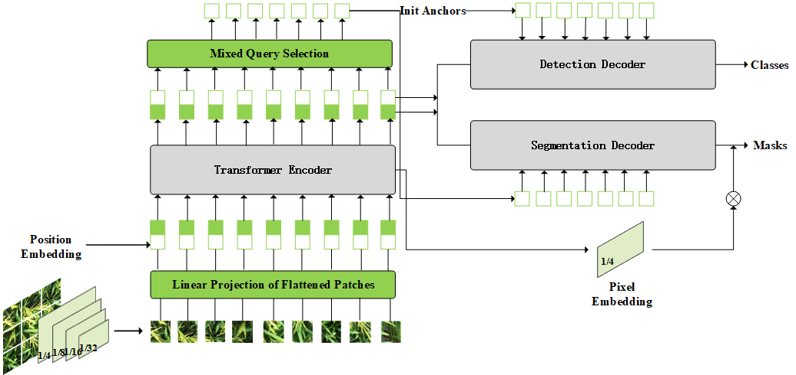
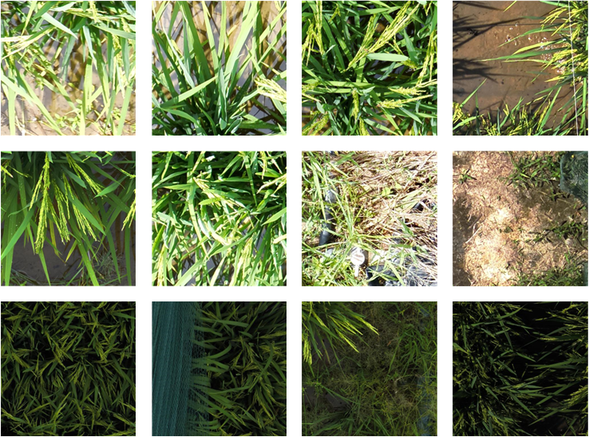

# NewDINOR: Enhancing Rice Breeding via Semi-Supervised Panicle & Leaf Analysis
This GitHub repository contains the source code and test data for reproducing the experiments in the paper titled "Enhancing Rice Breeding Efficiency through Semi-Supervised Detection and Segmentation of Panicles and Leaves". The research was funded by the Biological Breeding-National Science and Technology Major Project (2023ZD04076). The paper is currently submitted to The Visual Computer. We commit to providing complete training datasets with corresponding annotations for non-commercial users after official publication, in order to promote agricultural development and facilitate further research in this field.
_Funded by the Biological Breeding - National Science and Technology Major Project (No.2023ZD04076)_
## Overview
In the field of rice breeding, enhancing crop yield and quality is paramount. This study focuses on critical factors that directly influence yield, specifically the number of rice panicles and leaf width. We hypothesize that an increase in panicle count and leaf width area positively correlates with photosynthetic efficiency, significantly impacting final crop yield. Guided by this rationale, we aim to evaluate and select rice varieties exhibiting desirable phenotypes through targeted detection techniques. We employ an enhanced DINO (self-DIstillation with NO labels) model for detecting and segmenting rice panicles and leaves. The upstream task of our model functions as an unsupervised general feature extractor, capable of learning rich visual features from a substantial dataset of unlabeled rice images. The downstream task comprises two branches: detecting the number of rice panicles and segmenting leaf areas. By synergizing these branches, we accurately assess the photosynthetic potential and reproductive capacity of rice plants. Experimental results demonstrate that our model achieves superior performance in both rice panicle detection and leaf area segmentation tasks, exhibiting higher accuracy and robustness. Additionally, our model operates stably under varying environmental conditions, showcasing significant application value for practical rice breeding. By precisely evaluating panicle count and leaf width, our model facilitates the selection of varieties with high photosynthetic efficiency and yield potential, contributing positively to sustainable agricultural development.

## Dataset
We have created a dataset focused on the recognition and segmentation of rice leaves and panicles, which includes over 10000 images. Our dataset, as shown in the figure, was captured by drones at three test sites for different rice varieties. The collection process involved shooting at different times of the day (such as morning, noon, and evening) and from various angles and backgrounds of the rice leaves and panicles to ensure the diversity and representativeness of the samples. The actual measured data includes the length and width (angle) of the flag leaf, panicle length, and number of spikelets per panicle. The dataset is divided with 80\% for training and 20\% for testing.

## Run
envs can use requirements.txt
cython
scipy
shapely
timm
h5py
submitit
scikit-image
opencv-python
